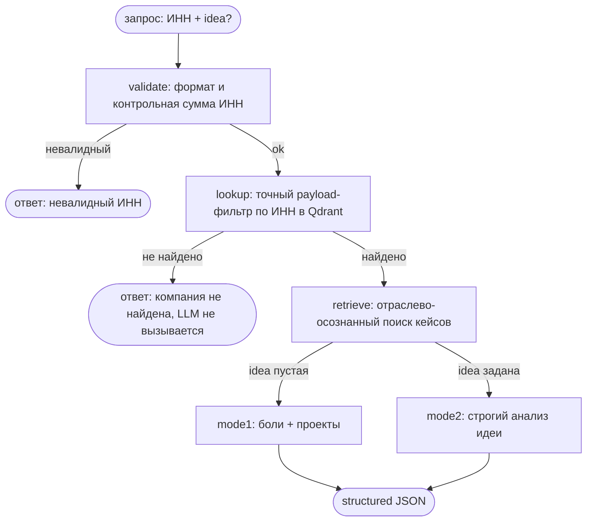

# 🤖 AI-ассистент цифровой трансформации

Веб-сервис на RAG: вводишь **ИНН компании** и (опционально) **идею проекта** —
получаешь анализ и рекомендации по цифровой трансформации.

- **Режим 1 (только ИНН):** 3–5 болей компании, решаемых автоматизацией/AI, и 1–3 проекта
  трансформации (суть, какую боль закрывает, шаги внедрения, ожидаемый эффект).
- **Режим 2 (ИНН + идея):** строгий анализ идеи — актуальность, какие боли закрывает/не
  закрывает, реалистичность (риски/ограничения/зависимости), итоговый вердикт с оценкой и,
  если идея слабая, — что доработать или чем заменить.

Оба режима опираются на контекст из RAG.

---

## 🧱 Архитектура

```
            ┌─────────────────────────── FastAPI ───────────────────────────┐
Frontend ──►│  POST /api/analyze         GET /api/health        /  (статика) │
(index.html)└───────────────────────────────┬───────────────────────────────┘
                                             │
                                   LangGraph-пайплайн
                                             │
   validate ──(невалидный ИНН)──────────────────────────────────────► ❌ ответ "невалидно"
       │ ok
   lookup  ──(ИНН не найден)──────────────────────────────────────────► ❌ ответ "не найдено"  (LLM не зовётся)
       │ found (точный payload-фильтр по ИНН в Qdrant)
   retrieve (семантический поиск отраслевых кейсов в Qdrant)
       ├─ idea пустая ──► mode1: рекомендации (GigaChat, structured JSON)
       └─ idea задана ──► mode2: строгий анализ идеи (GigaChat, structured JSON)
```

Пайплайн как граф (LangGraph):



**Ключевые решения:**

1. **Гибридный RAG.** ИНН — это точный идентификатор, а не семантический запрос. Поэтому
   карточка компании достаётся **детерминированным payload-фильтром** в Qdrant, а отраслевые
   кейсы для контекста — **семантическим поиском**. Это исключает «угадывание» не той компании.
2. **Анти-галлюцинации.** Если ИНН невалиден или компании нет в базе — сервис честно отвечает
   об этом и **не вызывает LLM** (экономия токенов + отсутствие выдумок). Системный промпт
   требует опираться только на контекст RAG.
3. **Строгий контракт вывода.** LLM возвращает JSON, который валидируется в Pydantic-схемы
   (с «ремонтным» проходом при сбое парсинга) — фронт рендерит надёжно, результат проверяем.
4. **Идеи генерирует LLM, а не выбирает из списка.** Боли и проекты GigaChat формулирует сам
   под конкретную компанию. Корпус отраслевых кейсов в Qdrant (боль → решение → эффект) —
   это **вдохновение и грантинг** (чтобы не было «воды»), а не готовые ответы: промпт прямо
   требует адаптировать идеи под специфику компании и предлагать решения сверх примеров,
   не выдумывая при этом фактов о самой компании.
5. **Отраслево-осознанный retrieval.** Сначала подбираются кейсы той же отрасли, затем
   набор добирается семантически близкими кейсами из всей базы (включая кросс-индустриальные).

### Стек
| Слой | Технология |
|---|---|
| Backend | Python 3.11, **FastAPI** |
| Оркестрация | **LangGraph** (узлы + условные переходы) |
| LLM | **GigaChat** (`langchain-gigachat`) |
| Эмбеддинги | **GigaChat Embeddings** (`EmbeddingsGigaR`) |
| Vector store | **Qdrant** (локальный контейнер или Qdrant Cloud) |
| Frontend | один `app/static/index.html` (vanilla JS) |
| Запуск | `docker compose up` |

---

## 🚀 Быстрый старт

### 1. Ключи в `.env`
```bash
cp .env.example .env
```
Открой `.env` и заполни как минимум:
```
GIGACHAT_CREDENTIALS=<твой Authorization key из developers.sber.ru>
GIGACHAT_SCOPE=GIGACHAT_API_PERS
GIGACHAT_VERIFY_SSL=false
```
Qdrant по умолчанию — локальный контейнер (ничего настраивать не нужно): он поднимается
вместе с приложением и **заполняется автоматически** при старте. Достаточно указать только
`GIGACHAT_CREDENTIALS`. Файл `.env` в `.gitignore` — ключи в репозиторий не попадают.

Чтобы вместо локального контейнера использовать **Qdrant Cloud**, раскомментируй и заполни:
```
QDRANT_URL=https://<cluster-id>.europe-west3-0.gcp.cloud.qdrant.io:6333
QDRANT_API_KEY=<твой Qdrant Cloud API key>
```
> Если `QDRANT_URL` задан — приложение ходит в облако, а локальный контейнер `qdrant`
> не используется (поэтому данные «не появляются» в нём — это ожидаемо).

### 2. Поднять сервисы

**Вариант «одной командой» (поднимает всё и сам открывает сайт):**
```bash
./start.sh           # macOS / Linux / Git Bash на Windows
```
На Windows можно просто дважды кликнуть по **`start.bat`** (или запустить его в терминале).
Скрипт выполнит `docker compose up`, дождётся готовности и откроет http://localhost:8000.

**Классический способ:**
```bash
docker compose up
```
Поднимутся `qdrant` и `app`. В конце логов будет явно напечатан адрес:
`Сервис запущен. Откройте в браузере: http://localhost:8000`.
> Открыть браузер автоматически из самого `docker compose up` нельзя (контейнер не управляет
> рабочим столом хоста) — поэтому для авто-открытия используйте `start.sh` / `start.bat`.

### 3. Залить базу знаний
При `SEED_ON_START=true` (значение по умолчанию в `.env.example`) база **заполняется
автоматически** при первом старте, если коллекция ещё пуста — отдельный шаг не нужен.

Заполнить/пересоздать базу вручную можно в любой момент:
```bash
docker compose exec app python seed.py
```
Скрипт прочитает `data/companies.json` и `data/knowledge/cases.json`, посчитает эмбеддинги
через GigaChat и загрузит их в Qdrant (коллекция пересоздаётся идемпотентно).
> Если вы меняли `data/*.json` — пересоздайте базу этой командой.

### 4. Открыть
- UI: **http://localhost:8000**
- Health: **http://localhost:8000/api/health**

---

## 🔌 API

`POST /api/analyze`
```jsonc
// Режим 1
{ "inn": "7733510051" }

// Режим 2
{ "inn": "7733510051", "idea": "AI-консультант по подбору техники на сайте" }
```

Пример (Режим 1, сокращённо):
```json
{
  "inn": "7733510051",
  "mode": 1,
  "found": true,
  "company": { "name": "Холодильник.ру", "industry": "E-commerce бытовой техники и электроники", "...": "..." },
  "retrieved_cases": ["AI-помощник подбора техники по потребностям", "..."],
  "mode1": {
    "pains": ["...", "...", "..."],
    "projects": [{ "title": "...", "essence": "...", "pain_addressed": "...", "steps": ["..."], "expected_effect": "..." }]
  }
}
```

`GET /api/company/{inn}` — быстрый lookup досье компании по ИНН (без LLM). UI вызывает его
первым и сразу рисует карточку компании, пока готовится анализ.

`GET /api/companies` — список компаний в базе знаний (UI показывает их кликабельными чипами).

`GET /api/health` — состояние сервиса, наличие коллекции и ключей.

---

## 🧭 База знаний (7 компаний)

| ИНН | Компания | Отрасль |
|---|---|---|
| 9709058127 | Копирка 24 | Полиграфия и копировальные центры |
| 7802574122 | Yami Yami (ООО «Новые Технологии») | Фудтех и доставка еды |
| 7705947629 | ГОРЗДРАВ (ООО «АПТЕКА-А.в.е») | Аптечный ритейл и фармацевтика |
| 7733510051 | Холодильник.ру | E-commerce бытовой техники |
| 7728760803 | Генотек | Биотех и медицинская генетика |
| 7704576019 | Альтернативные Системы Делюкс | Управление недвижимостью и ЖКХ |
| 7725641460 | Progression Group (ООО «Прогрешен») | Маркетинг и реклама |

Данные собрал из открытых источников (РБК Компании, rusprofile и др.) и перепроверены.
Формат — JSON; добавление компании = новый объект в `data/companies.json` + повторный `seed.py`.

---

## ✅ Проверка качества (eval)

```bash
# локально, из корня проекта (нужен заполненный .env и выполненный seed.py)
python -m eval.test_cases
# или внутри контейнера:
docker compose exec app python -m eval.test_cases
```
Проверяется: валидация ИНН (оффлайн), честный ответ на неизвестный ИНН (без LLM),
структура рекомендаций в Режиме 1, отклонение заведомо слабой идеи в Режиме 2.
Интеграционные проверки автоматически пропускаются (SKIP), если окружение не готово.

---

## 🗂️ Структура

```
.
├── docker-compose.yml          # qdrant + app
├── Dockerfile                  # + корневой CA Минцифры для GigaChat
├── .env.example                # все переменные окружения
├── requirements.txt
├── seed.py                     # загрузка базы знаний в Qdrant
├── data/
│   ├── companies.json          # 7 карточек компаний
│   └── knowledge/cases.json    # отраслевые кейсы (обогащение RAG)
├── app/
│   ├── main.py                 # FastAPI + раздача фронта
│   ├── config.py               # pydantic-settings (.env)
│   ├── gigachat_client.py      # фабрики GigaChat (chat + embeddings)
│   ├── rag.py                  # гибридный поиск в Qdrant
│   ├── graph.py                # LangGraph-пайплайн
│   ├── llm.py                  # structured output (JSON → Pydantic)
│   ├── prompts.py              # промпты двух режимов
│   ├── schemas.py              # Pydantic-схемы
│   ├── inn_utils.py            # валидация ИНН (контрольная сумма)
│   └── static/index.html       # фронтенд
└── eval/test_cases.py          # мини-eval
```

---

## ⚙️ Заметки и нюансы

- **Токен-бюджет GigaChat.** Модель задаётся через `GIGACHAT_MODEL`. На freemium у `GigaChat`
  (Lite) большой запас токенов — удобно для разработки и тестов; для финального демо можно
  переключить на `GigaChat-Max` (лучшее качество анализа). Эмбеддинги расходуются отдельным
  большим пакетом.
- **SSL GigaChat.** Сертификаты УЦ Минцифры РФ отсутствуют в стандартном trust-store. В образ
  добавляется корневой сертификат (в bundle `certifi`). По умолчанию `GIGACHAT_VERIFY_SSL=false`
  для простоты локального запуска; для строгой проверки поставь `true`.
- **UX анализа.** Сначала отдельным быстрым запросом (`/api/company/{inn}`) рисуется досье
  компании, затем приходит структурированный анализ: цветной вердикт со шкалой, разделы
  «закрывает / не закрывает» с подсветкой, проекты карточками — удобно сканировать глазами.
- **Безопасность.** Секреты только в `.env` (он в `.gitignore`); в репозитории — `.env.example`
  с плейсхолдерами. Ключи нигде не хардкодятся. ⚠️ Если ключи где-то засветились — перевыпусти
  их (Client Secret в GigaChat, API key в Qdrant Cloud).
